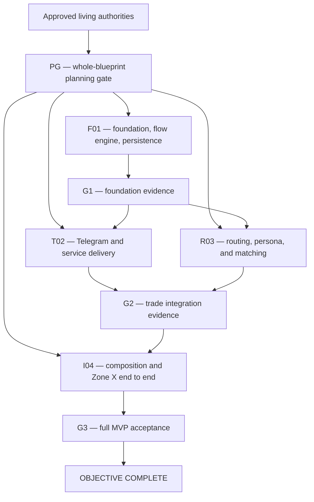

# Friendly Bot Local MVP Implementation Masterplan

> Frozen execution blueprint for delivering the approved Friendly Bot local MVP through independently owned worker packages.

**Coordinator/worker phase contract**

| Phase | Required fact |
| --- | --- |
| Coordinator | Freeze the blueprint, DAG, gates, contracts, briefs, and reserved paths; do not author a worker's detailed specification or implementation plan. |
| Pass 1 — worker planning and UI design | Each ordinary worker authors its own dated specification and detailed plan. Each UI-design worker uses fixtures/mock state to design presentation and contents, writes a separate UI requirements contract and presentation handoff, integrates its evidence into `origin/main`, and stops before live wiring. |
| Whole-blueprint gate | The coordinator passes the receipt only after the complete Pass 1 set is reconciled and reachable from `origin/main`; one worker's approved plan or UI handoff never authorizes execution. |
| Pass 2 — worker execution | Only after that passed receipt does an ordinary execution prompt direct implementation, after verifying the worker's hard implemented prerequisites and required evidence on `origin/main`. The named live-wiring worker consumes the UI requirements contract and accepted handoff. |

**Shared-main lifecycle**

| Item | Required fact |
| --- | --- |
| Mode | In a genuinely shared checkout, read-only planning may run in parallel; the exclusive shared-checkout main-mutation lock covers every filesystem edit and Git/index operation through remote-reachability proof. |
| Fallback | Only when that lock cannot exist, use normal clones on `main` for different machines or a documented incompatible shared checkout. A cross-clone push lock or queue covers only reconciliation → affected focused verification → push → remote-ancestry proof; it does not impose a global edit lock across clones. |
| Checkpoint cadence | After every independently testable substep—a coherent plan task or subtask with its own focused verification—run the focused check, stage only owned paths, commit directly to `main`, fetch and merge newer `origin/main`, rerun affected checks, push, and prove remote reachability before the next substep. |
| Safety | Preserve and report unrelated dirt; never clean, stash, reset, overwrite, or remove it. Never rebase or force-push published `main`. |

| Field | Value |
| --- | --- |
| Status | Approved execution snapshot; `PG` passed for the pinned planning set |
| Blueprint ID | `2026-09-12-friendly-bot-mvp` |
| Effective date | 2026-09-12 |
| Integration authority | `origin/main` |
| Checkout mode | Genuinely shared checkout at `/Users/bot2/Dev/ZoneExperience`, directly on `main` |
| Shared-checkout main-mutation lock | `/tmp/friendly-bot-main-mutation-u504.lock` |
| Cross-clone queue | Not applicable |
| Coordinator | Primary Codex agent acting for Ryan The |
| Product authority | `friendly-bot/docs/masterplans/product-specification.md` |
| Architecture authority | `friendly-bot/docs/masterplans/architecture.md` |
| Detailed approved design | `friendly-bot/docs/superpowers/specs/2026-09-11-friendly-bot-mvp-design.md` |
| Canonical service fixture | `friendly-bot/docs/examples/zone-x-service-example.md` |
| Worker specification root | `friendly-bot/docs/superpowers/specs/2026-09-12-friendly-bot-mvp/` |
| Worker plan root | `friendly-bot/docs/superpowers/plans/2026-09-12-friendly-bot-mvp/` |
| Coordination root | `friendly-bot/docs/workers/2026-09-12-friendly-bot-mvp/` |
| Planning receipt | `friendly-bot/docs/workers/2026-09-12-friendly-bot-mvp/PLANNING_GATE.md` |
| Runtime identity | macOS account `bot2`, UID `504`, slot `4`, offset `400`, runtime `u504` |

## 1. Purpose and execution question

This blueprint answers one question: how will the approved Friendly Bot MVP become a locally runnable, tested Python system without workers colliding on shared schemas, composition, or Git state?

The living product and architecture masterplans own approved behavior and current truth. This frozen document owns delivery boundaries, hard dependencies, readiness, integration, and evidence. Worker specifications and plans own task-level decisions and steps.

Workers use repository artifacts and `origin/main`, never worker-to-worker chat, private context, feature branches, linked worktrees, stashes, or unpublished commits. The coordinator schedules mutation ownership through the named lock.

## 2. Bounded outcome and delivery gates

The outcome is a local Python application started with `python -m friendly_bot`, backed by account-isolated PostgreSQL, that executes validated recursive discussion flows; long-polls Telegram durably; runs service timestamps; routes with OpenRouter under the privacy boundary; performs normal and safety matching; maintains personas; loads Zone X from canonical JSON; and passes unit, integration, and end-to-end tests.

| Gate | Outcome | Hard prerequisites | Evidence | Verifier | Unlocks |
| --- | --- | --- | --- | --- | --- |
| `PG` | Complete planning set is mutually consistent and execution-authorized | `F01`, `T02`, `R03`, and `I04` planning handoffs | Passed receipt pinned to reachable `origin/main` | Coordinator | `F01` execution |
| `G1` | Foundation contracts are implemented | `PG`, `F01` | Flow/schema unit and PostgreSQL integration suites; migration upgrade succeeds | Coordinator | `T02`, `R03`, and `I04` prerequisite recovery |
| `G2` | Telegram/service and routing/matching packages are integrated | `G1`, `T02`, `R03` | Each worker's focused suite and remote completion manifest | Coordinator | `I04` execution |
| `G3` | Local MVP is release-ready | `I04` | Full suite once, Zone X end-to-end run, privacy assertions, restart/idempotency tests, clean `main` equal to `origin/main` | Ryan The or coordinator | Objective complete |

## 3. Foundations workers must reuse

- The approved product contract, architecture decisions `ARCH-001` through `ARCH-013`, detailed design, and canonical Zone X service document at `origin/main` commit `8d44ab7`.
- EdenMind's Telegram reliability concepts and read-only reference implementation at `/Users/bot2/Dev/EdenMind/edenmind-api/src/edenmind/tuition/telegram.py`, with tests under `/Users/bot2/Dev/EdenMind/edenmind-api/tests/integration/tuition/`. Workers adapt transport durability, typed payloads, webhook clearing, offset/deduplication, retry classification, redaction, and single-runtime ownership; they do not copy tuition behavior or EdenMind domain records.
- Git repository, direct `main` workflow, Ryan The commit identity, and `origin/main` as the only integration authority.

No application package, schema, migration, or test foundation exists yet. A worker must not invent a second implementation of a contract owned by another package for local convenience.

## 4. Locked boundaries and ownership

- Real-world gatherings are `Service` records; `ActionEvent` is internal flow-execution terminology.
- `DiscussionFlow` is the only flow type. Triggers and actions are typed discriminated unions; definitions are versioned JSON/JSONB.
- The model returns configured keys only. It never writes user-facing responses.
- Structured Telegram IDs and DOBs never enter OpenRouter input. OpenRouter requests require ZDR and denied provider data collection.
- Unhandled `error` dispatch invokes the code-owned hardcoded sender. It is never a configured or root discussion flow.
- Normal matching selects exact-role servers attending the service. Safety matching selects leaders or staff who attend or are always available.
- `users.role` is the sole role source; operational profiles reference users and never duplicate role.
- Zone X is the first JSON seed and end-to-end acceptance fixture.
- PostgreSQL owns durable state; correctness does not depend on process memory.
- No web admin UI, bot-relayed human chat, serverless hosting, free-form LLM answers, or production deployment is included.

### 4.1 Shared mutable surfaces

| Surface | Owner | Dependants | Change protocol |
| --- | --- | --- | --- |
| Packaging, dependency lock, formatter/type/test configuration | `F01` | All workers | Integrate and prove tool commands before dependants execute |
| SQLAlchemy metadata, migrations, repository interfaces, transaction unit | `F01` | `T02`, `R03`, `I04` | Single migration sequence; dependants request contract changes through coordinator evidence |
| Flow domain models, publication validation, state-transition engine | `F01` | `T02`, `R03`, `I04` | Typed API and tests integrate before consumers execute |
| Telegram transport and service scheduling/application packages | `T02` | `I04` | `T02` owns implementation and focused tests; `I04` only composes |
| OpenRouter routing, persona, and matching packages | `R03` | `I04` | `R03` owns implementation and focused tests; `I04` only composes |
| Runtime composition, action registry, Zone X JSON seed, CLI, end-to-end tests | `I04` | `G3` | Consume merged contracts; do not duplicate owned implementations |
| Product and architecture living masterplans | Coordinator | All workers | Workers record proposed impact; coordinator reconciles stable changes |
| Planning receipt and aggregate status | Coordinator | All workers | Workers never edit coordinator-owned receipts |

### 4.2 Account-local runtime isolation

| Item | Required fact |
| --- | --- |
| Identity | Account `bot2` has validated UID `504`, slot `4`, offset `400`, and runtime ID `u504`; worker IDs are not runtime identities. |
| Ports | Friendly Bot PostgreSQL uses loopback port `5832`, the tracked base `5432` plus offset `400`. Client, API, and Supabase ports are not applicable. No dynamic/free-port fallback is allowed. |
| Namespaces | Docker Compose project `friendly-bot-u504`, network `friendly-bot-u504`, volume `friendly-bot-u504-postgres`, and ignored generated state under `.runtime/u504/` are distinct for this runtime. |
| Configuration | Compose is the tracked source. Secrets remain environment-provided and ignored. External publication binds PostgreSQL to `127.0.0.1:5832` only. |
| Safety | Validate account, repository path, namespace, and port before mutation. A conflict fails before Docker changes. Start, stop, reset, and clean only exact `friendly-bot-u504` resources; never alter another Docker/Colima runtime. |
| Readiness | Prove `pg_isready` on `127.0.0.1:5832`, migration upgrade from empty succeeds, application database connectivity succeeds, and teardown commands name only the exact Compose project. Record redacted commands and results; never record credentials. |

## 5. Pre-execution planning and authorization

### 5.1 UI-design decision

No separate UI-design worker applies. The MVP uses Telegram-native messages, buttons, photos, and activity indicators; no custom visual hierarchy, layout, responsive surface, or motion system is being built. User-facing copy remains owned by approved flow configuration and the product specification.

### 5.2 Complete planning set

All four ordinary workers are planning-ready from the approved authorities and this blueprint. `F01`, `T02`, and `R03` may plan concurrently as read-only work, but shared-checkout mutations serialize through the lock. `I04` begins its detailed plan after the other three planned interfaces are reachable from `origin/main`; it does not wait for their implementation.

Each worker authors its reserved dated specification, detailed TDD plan, status contract, and planning completion manifest. A worker may propose authority corrections, but the coordinator owns edits to the living masterplans and blueprint. The coordinator reviews the full set together and alone writes the passed `PLANNING_GATE.md`.

### 5.3 Execution-ready predicate

`F01` needs the passed planning receipt. `T02` and `R03` need the receipt plus implemented `F01` evidence. `I04` needs the receipt plus implemented `F01`, `T02`, and `R03` evidence. A passed planning gate never substitutes for missing code.

## 6. Execution graph

### 6.1 Graph-shape evidence

| Metric | Value | Explanation |
| --- | --- | --- |
| Worker nodes | 4 | One shared foundation, two non-overlapping trade packages, and one composition/acceptance owner |
| Hard edges | 13 | `A→PG`, four `PG→worker` edges, `F01→G1`, two `G1→trade` edges, two `trade→G2` edges, `G2→I04`, `I04→G3`, and `G3→DONE` |
| Planning-ready frontier | 3: `F01`, `T02`, `R03` | Independent task planning from locked authorities |
| Execution-ready trade frontier | 2: `T02`, `R03` | The MVP is small; splitting further would fragment service or intelligence ownership |
| Peak logical width | 3 | Planning frontier, independent of the active slot limit |
| Active execution slots | 3 child-agent slots plus coordinator | Capacity does not alter hard dependencies |
| Width exception | Execution trade layer width 2 | A third trade would split tightly coupled action/repository or runtime-composition surfaces; the integration node is intentionally sequential |

### 6.2 Dependency parity

| ID | Depends on | Unblocks |
| --- | --- | --- |
| `PG` | All four planning handoffs | `F01` execution and execution authorization |
| `F01` | `PG` | `G1`; typed domain, schema, repository, and tooling contracts |
| `G1` | `F01` | `T02`, `R03` |
| `T02` | `PG`, `G1` | `G2`; Telegram/service APIs and evidence |
| `R03` | `PG`, `G1` | `G2`; router/persona/matching APIs and evidence |
| `G2` | `T02`, `R03` | `I04` |
| `I04` | `PG`, `G1`, `G2` | `G3`; runnable application and Zone X acceptance fixture |
| `G3` | `I04` | Objective complete |

The graph is acyclic. Planning coordination from `F01`/`T02`/`R03` plans into `I04` is a Pass 1 planned-contract dependency, not an implemented execution edge.

## 7. Readiness and blocker rules

- `planning-ready`: the frozen blueprint, brief, applicable living authorities, and required planned contracts are reachable from inspected `origin/main`.
- `planning-in-progress`: a worker is producing its specification and plan without implementation.
- `planning-complete / execution-blocked`: worker planning is integrated, but `PG` is open or an implemented prerequisite is missing.
- `execution-ready`: the passed receipt and every hard implemented prerequisite are verified on the receipt's reachable `origin/main` lineage.
- `unverified`: remote commit or required evidence was not inspected; never treat it as ready.
- `in-progress`, `review`, `blocked`, and `complete` carry their ordinary evidence-backed meanings.

Stop for unresolved product/security decisions, semantic ownership conflicts, unsafe external mutations, stale planning receipt, unreachable remote evidence, or incompatible migration contracts. A proven incomplete upstream deliverable after that worker ends is recovered by the dependant for only the missing prerequisite; it is not returned to the user as a staffing question.

## 8. Mandatory worker lifecycle

Pass 1 workers inspect `origin/main`, use brainstorming and writing-plans, author only their owned specification/plan/status/manifest, run document checks, commit directly to `main` while holding the lock, reconcile newer `origin/main`, push, prove reachability, and stop. No product code is allowed before `PG` passes.

Pass 2 workers verify the receipt and prerequisites, read the approved worker artifacts, use test-driven development, request and address review, run focused checks at meaningful checkpoints, and commit/pull/push directly on `main` under the same lock. Each runs the full suite only once after all its owned tasks finish. Every worker preserves unrelated dirt and never rebases or force-pushes published `main`.

Every worker launch contains these exact controls:

> Whenever you are stuck/blocked by a decision, take the recommended unless it majorly changes the original combined masterplans/specs. If there  any issues from other workers just assume the role of the blocking worker and fix it yourself. Then resume and finish the original worker.

> Old MVP2 and earlier documents are HARD LOCKED unless I explicitly tell you to modify them. At no point should you modify them or suggest modifying them.

This is a pre-production repository with no live users. Workers update all callers, tests, fixtures, and contracts directly; they add no legacy adapters, compatibility shims, duplicate paths, or unnecessary fallbacks.

## 9. Worker packages

### Worker F01 — Foundation, flow engine, and persistence

**Role:** Ordinary execution worker.

**Planning prerequisites:** Approved authorities, canonical Zone X document, and this blueprint.

**Hard execution prerequisites:** Passed `PG`.

**Owns:** `friendly-bot/pyproject.toml`, dependency lock, formatter/type/test configuration, `friendly-bot/src/friendly_bot/config/`, `domain/`, `persistence/`, Alembic files, Compose configuration, `tests/unit/domain/`, `tests/integration/persistence/`, its worker artifacts and status.

**Does not own:** Telegram/service behavior, OpenRouter/persona/matching behavior, central runtime composition, Zone X JSON seed, or living masterplans.

**Work outcomes:** Installable Python package; validated recursive flow/action/trigger model; publication rules; open-selection/checkpoint state engine; complete PostgreSQL schema and repository/unit-of-work contracts; account-isolated Compose database; migration evidence.

**Reserved artifacts:**

- Specification: `friendly-bot/docs/superpowers/specs/2026-09-12-friendly-bot-mvp/2026-09-12-f01-foundation-flow-persistence-design.md`
- Plan: `friendly-bot/docs/superpowers/plans/2026-09-12-friendly-bot-mvp/2026-09-12-f01-foundation-flow-persistence.md`
- Status: `friendly-bot/docs/workers/2026-09-12-friendly-bot-mvp/status/f01.md`
- Planning manifest: `friendly-bot/docs/workers/2026-09-12-friendly-bot-mvp/completion-manifest/f01-planning.json`
- Execution manifest: `friendly-bot/docs/workers/2026-09-12-friendly-bot-mvp/completion-manifest/f01-execution.json`

**Acceptance evidence:** Flow parsing/validation/state tests; migration upgrade against `127.0.0.1:5832`; repository transaction/idempotency tests; type and lint checks.

**Merge condition:** Owned tests and review pass, exact files are staged, commit is reachable from `origin/main`, and no owned dirt remains.

**Unblocks:** `G1`, then `T02` and `R03` execution.

### Worker T02 — Telegram transport and service delivery

**Role:** Ordinary execution worker.

**Planning prerequisites:** Approved authorities, blueprint, and EdenMind Telegram references. Its final plan reconciles the published `F01` planned interfaces.

**Hard execution prerequisites:** Passed `PG` and `G1` foundation evidence.

**Owns:** `friendly-bot/src/friendly_bot/telegram/`, `services/`, `onboarding/`, `tests/unit/telegram/`, `tests/unit/services/`, `tests/integration/telegram/`, `tests/integration/services/`, and its worker artifacts/status.

**Does not own:** Schema/migrations, generic flow engine, OpenRouter/persona/matching, action registry, application composition, Zone X seed, or living masterplans.

**Work outcomes:** Typed Telegram Bot API client; webhook clearing and durable long polling; update parsing/deduplication; outbound durability semantics; onboarding/login/manage/logout application services; service attendance/highkey/latecomer/expiry; timestamp claiming, audiences, catch-up, and idempotent delivery.

**Reserved artifacts:**

- Specification: `friendly-bot/docs/superpowers/specs/2026-09-12-friendly-bot-mvp/2026-09-12-t02-telegram-service-delivery-design.md`
- Plan: `friendly-bot/docs/superpowers/plans/2026-09-12-friendly-bot-mvp/2026-09-12-t02-telegram-service-delivery.md`
- Status: `friendly-bot/docs/workers/2026-09-12-friendly-bot-mvp/status/t02.md`
- Planning manifest: `friendly-bot/docs/workers/2026-09-12-friendly-bot-mvp/completion-manifest/t02-planning.json`
- Execution manifest: `friendly-bot/docs/workers/2026-09-12-friendly-bot-mvp/completion-manifest/t02-execution.json`

**Acceptance evidence:** Contract tests adapted from relevant EdenMind durability patterns; onboarding/auth/service/timestamp tests; definite-versus-ambiguous send retry evidence; restart recovery tests.

**Merge condition:** Owned checks and review pass, no EdenMind product-specific behavior is copied, commit is remote-reachable, and no owned dirt remains.

**Unblocks:** `G2` and `I04` service integration.

### Worker R03 — Constrained routing, persona, and matching

**Role:** Ordinary execution worker.

**Planning prerequisites:** Approved authorities and blueprint. Its final plan reconciles the published `F01` planned interfaces.

**Hard execution prerequisites:** Passed `PG` and `G1` foundation evidence.

**Owns:** `friendly-bot/src/friendly_bot/hyperparameters.py`, `routing/`, `persona/`, `matching/`, `tests/unit/routing/`, `tests/unit/persona/`, `tests/unit/matching/`, `tests/integration/routing/`, `tests/integration/matching/`, and its worker artifacts/status.

**Does not own:** Schema/migrations, generic flow engine, Telegram/service packages, action registry, application composition, Zone X seed, or living masterplans.

**Work outcomes:** OpenRouter gateway with approved cheap model in `hyperparameters.py`, ZDR and denied collection; key-only constrained routing over current/global/reusable candidates and native-reply text; ambiguity/no-match reserved outcomes; persona maintenance from the prior cursor; server-only and leader/staff safety matching with capacity/rematch rules.

**Reserved artifacts:**

- Specification: `friendly-bot/docs/superpowers/specs/2026-09-12-friendly-bot-mvp/2026-09-12-r03-routing-persona-matching-design.md`
- Plan: `friendly-bot/docs/superpowers/plans/2026-09-12-friendly-bot-mvp/2026-09-12-r03-routing-persona-matching.md`
- Status: `friendly-bot/docs/workers/2026-09-12-friendly-bot-mvp/status/r03.md`
- Planning manifest: `friendly-bot/docs/workers/2026-09-12-friendly-bot-mvp/completion-manifest/r03-planning.json`
- Execution manifest: `friendly-bot/docs/workers/2026-09-12-friendly-bot-mvp/completion-manifest/r03-execution.json`

**Acceptance evidence:** Prompt-redaction and provider-policy tests; constrained key/multi-selection/ambiguity tests; persona cursor tests; concurrent reservation, capacity, role, attendance, always-available, exclusion, and rematch tests.

**Merge condition:** Owned checks and review pass, privacy-negative assertions are explicit, commit is remote-reachable, and no owned dirt remains.

**Unblocks:** `G2` and `I04` intelligence integration.

### Worker I04 — Runtime composition and Zone X acceptance

**Role:** Ordinary execution and final integration worker.

**Planning prerequisites:** Approved authorities and blueprint plus the published planned interfaces from `F01`, `T02`, and `R03`.

**Hard execution prerequisites:** Passed `PG`, `G1`, and `G2` evidence.

**Owns:** `friendly-bot/src/friendly_bot/actions/`, `app.py`, `__main__.py`, root package exports, `friendly-bot/seeds/zone-x.json`, example environment/run documentation, `tests/e2e/`, central test fixtures, final cross-package fixes under the failed-upstream recovery rule, and its worker artifacts/status.

**Does not own:** Upstream package internals unless a concrete prerequisite is proven incomplete after its worker ends; living masterplans remain coordinator-owned.

**Work outcomes:** Registered action executors; hardcoded unhandled-error sender; dependency composition; local CLI; canonical Zone X JSON seed equivalent to the human-readable document; full onboarding-to-service-to-match flows; admin diagnostics; clean restart and local run evidence.

**Reserved artifacts:**

- Specification: `friendly-bot/docs/superpowers/specs/2026-09-12-friendly-bot-mvp/2026-09-12-i04-runtime-zone-x-design.md`
- Plan: `friendly-bot/docs/superpowers/plans/2026-09-12-friendly-bot-mvp/2026-09-12-i04-runtime-zone-x.md`
- Status: `friendly-bot/docs/workers/2026-09-12-friendly-bot-mvp/status/i04.md`
- Planning manifest: `friendly-bot/docs/workers/2026-09-12-friendly-bot-mvp/completion-manifest/i04-planning.json`
- Execution manifest: `friendly-bot/docs/workers/2026-09-12-friendly-bot-mvp/completion-manifest/i04-execution.json`

**Acceptance evidence:** JSON/YAML semantic equivalence check; hardcoded-error negative configuration check; Zone X end-to-end suite; full suite once; `python -m friendly_bot` startup canary; clean local/remote main proof.

**Merge condition:** Every gate criterion passes at one remote commit, code review is closed, no owned dirt remains, and coordinator records `G3` evidence.

**Unblocks:** MVP completion.

## 10. Shared integration contracts

| Contract | Owner | Consumers | Required validation | Change handling |
| --- | --- | --- | --- | --- |
| Flow definitions and execution transitions | `F01` typed domain API | `T02`, `R03`, `I04` | Recursive parsing, publication invariants, checkpoint/reuse tests | `F01` updates planned contract before dependants implement |
| Repository/unit-of-work interfaces | `F01` | All packages | PostgreSQL integration and concurrency tests | Single migration owner; no dependant-local tables |
| Normalized incoming/outgoing Telegram DTOs | `T02` | `I04` | Contract fixtures, redaction, send-outcome classification | `T02` owns wire semantics |
| Service context and audience resolution | `T02` | `R03`, `I04` | Attendance/lifecycle/timestamp tests | Cross-plan signatures reconcile in Pass 1 |
| Router decision DTO and privacy filter | `R03` | `I04` | Allowed-key parser and structured-identifier exclusion | Fail closed; no alternate free-form route |
| Match request/result DTOs | `R03` | `I04` actions | Role/capacity/attendance/concurrency tests | Separate normal and safety entry points |
| Action executor registry and terminal event dispatch | `I04` consuming `F01` | Runtime | Every configured action type registered; direct-child outcome coverage | Central owner resolves composition only |
| Zone X JSON seed | `I04`, derived from canonical document | Runtime and E2E tests | Semantic graph/key/copy/outcome equivalence | Update seed, canonical doc, authorities, and tests together |

## 11. Integration gates

### Gate PG — Whole-blueprint planning receipt

**Prerequisites:** All four worker specifications, plans, statuses, planning manifests, authority-impact findings, and cross-plan interface reconciliation are reachable from `origin/main`.

**Acceptance evidence:** No placeholders; exact files and commands; interface names agree; every spec requirement maps to a task; no ownership collision; receipt pins current remote commit.

**Verifier:** Coordinator. On failure, the owner of the stale artifact updates it; all execution remains blocked.

### Gate G1 — Foundation evidence

**Prerequisites:** `F01` execution complete.

**Acceptance evidence:** Fresh unit, type/lint, migration, and PostgreSQL repository results plus a remote execution manifest.

**Verifier:** Coordinator. On failure, `F01` repairs; `T02`, `R03`, and `I04` remain blocked.

### Gate G2 — Trade integration evidence

**Prerequisites:** `T02` and `R03` execution complete against the same foundation lineage.

**Acceptance evidence:** Fresh owned focused suites, remote manifests, and central import-contract smoke tests.

**Verifier:** Coordinator. On failure, owning trade repairs; `I04` remains blocked.

### Gate G3 — MVP acceptance

**Prerequisites:** `I04` integrated after `G2`.

**Acceptance evidence:** One fresh full-suite run, canonical Zone X end-to-end behavior, local startup/database canary, privacy/error-path negative tests, remote ancestry equality, and no owned dirt.

**Verifier:** Ryan The or coordinator. On failure, `I04` owns integration repair and bounded prerequisite recovery.

## 12. Coordination status

Worker status lives only in its reserved status document. The coordinator owns `STATUS.md` and `PLANNING_GATE.md`. Every readiness finding names an inspected `origin/main` commit and is `unverified` otherwise. Ready work that lacks an agent slot remains ready, not blocked.

Workers may inspect in parallel but mutate only while holding the shared lock. A lock holder includes its worker ID and timestamp in `owner`, retains it through verification/commit/pull/push/remote proof, and removes only its own lock directory afterward. A stale lock is never deleted without proving its owner is inactive and its Git state is preserved.

## 13. Main integration and conflict policy

- Work only on checked-out `main`; no branches, worktrees, detached HEAD, stash lanes, rebases, or force pushes.
- Before each mutation checkpoint, reconcile with `origin/main` while safe and preserve unrelated changes.
- Stage exact owned paths. Never use broad staging when another scope is dirty.
- After a coherent checkpoint, run focused checks, commit, pull/merge newer `main`, rerun affected checks, push, and prove the commit reachable from `origin/main` before continuing.
- Mechanical conflicts inside owned surfaces are resolved by the owner. Semantic, schema, generated-artifact, or cross-owner conflicts stop for coordinator resolution.
- Workers do not message each other; commits, status, manifests, and coordinator findings are the coordination channel.
- A dependant may take over only a proven incomplete hard prerequisite after its original worker's attempt ends, and must update both sides' evidence.

## 14. Handoff and cleanup

Each worker handoff names its final commit, remote reachability, specification and plan, authority-impact result, focused/full verification as applicable, review result, operational commands, limitations, and downstream contracts. Completion manifests are lowercase JSON and owned exclusively by the worker.

At final completion, the coordinator refreshes `main`, runs the full suite once at the integrated revision, proves remote equality, updates living authorities with stable implementation evidence, records final status, preserves all handoffs, and removes only the coordinator's own lock. Dirty or uncertain state is never discarded.

## 15. Explicit exclusions

- Cloud/serverless hosting, webhooks, and managed scheduling.
- Admin or flow-builder graphical UI.
- Bot-relayed human chat.
- Free-form LLM user-facing answers.
- Operational-user accept/decline and strong identity verification.
- NBNC newcomer/new-believer subtype.
- Retention deletion UI and production backup automation.
- Production launch approval for Zone X's development venue, copy, names, or contact URLs.

## 16. Revision policy

Ordinary progress changes status, not this blueprint. A material approved change to scope, ownership, dependencies, shared interfaces, security/privacy, acceptance, or a worker plan reopens `PG`. Affected execution pauses safely until living authorities, downstream plans/briefs/statuses, and the full planning receipt are reconciled and republished at current `origin/main`. Clarifications that do not alter behavior may amend the relevant worker artifact without reopening unrelated execution, with an evidence-backed no-impact finding.
